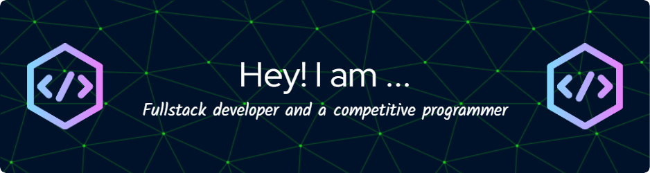

<h1 align="center">Hi 👋, I'm Tejas joharapurkar</h1>
<h3 align="center">A passionate fullstack MERN developer ans a Competitive Programer from India.Have solved 500+ Leetcode questions and achive a contest rating of 1543.</h3>

  

- 🌱 I’m currently learning **Microservices and .Net framework**

- 👯 I’m looking to collaborate on **React Open Source Projects**

- 👨‍💻 All of my projects are available at [https://tejasjoharapurkar-portfolio.netlify.app/](https://tejasjoharapurkar-portfolio.netlify.app/)

- 💬 Ask me about **question related to CP in c++ and React**

- 📫 How to reach me **joharapurkartejas@gmail.com**

- 📄 Know about my experiences [https://drive.google.com/file/d/1INF0ZXI4hXiQZn54RgfVpuhD91yQ1JYW/view?usp=sharing](https://drive.google.com/file/d/1INF0ZXI4hXiQZn54RgfVpuhD91yQ1JYW/view?usp=sharing)

<h3 align="left">Connect with me:</h3>

<h3 align="left">Languages and Tools:</h3>

            

&nbsp;

